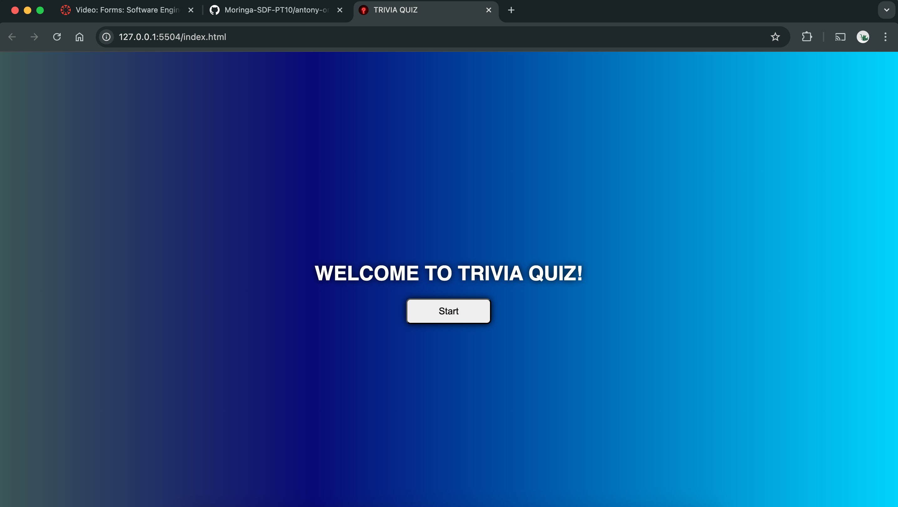

# 🧠 TRIVIA QUIZ GAME
Welcome to the Trivia Quiz Game that uses a public API to generate the question sand answers then lets the user choose their answer and after answering the six questions, it displays the final score.

## Summary
The Trivia Quiz Game uses `Open Trivia DB API` to generate random trivia questions which are displayed for the user to answer. 

The question are choosen at random from a pool of different fields and displayed for the user to answer.

## Application Features

- Start the Trivia Quiz by clicking the Start Button on the landing page
- Dynamically load 5 multiple choice questions from the Open Trivia DB API
- Answeres are shuffled to make sure the correct answer is not in the same position every time
- Track and show the score
- Restart functionality
- Keyboard input 'Enter' for 'Next'
- Hover effect on the buttons

## Technologies Used

- `HTML`
- `CSS`
- `JavaScript`
- `Open Trivia DB API`

## Project Structure
```
📦 antony-omondi-trivia-project
├─ index.html       
├─ index.js
├─ styles.css
├─ README.md
└─ assets
   └─ trivia-favicon.png
```

## How To Use
- **Fork and clone the repository**
- Open the html file in browser
- Clock the **Start** button to start
- Click the desired answer to select it.
- Click **Next** or press **Enter** to go to the next question
- After answering all the questions, your final score will be displayed.
- Click **Restart Quiz** to start again

## Preview/Screenshots



